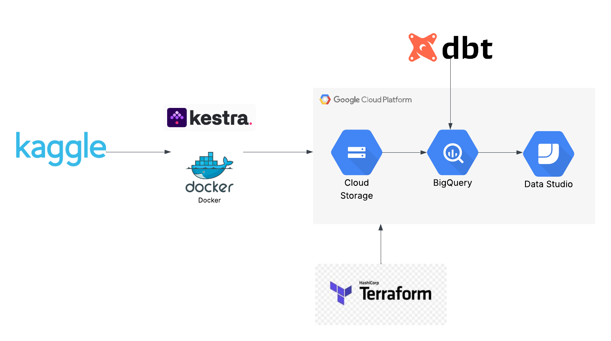
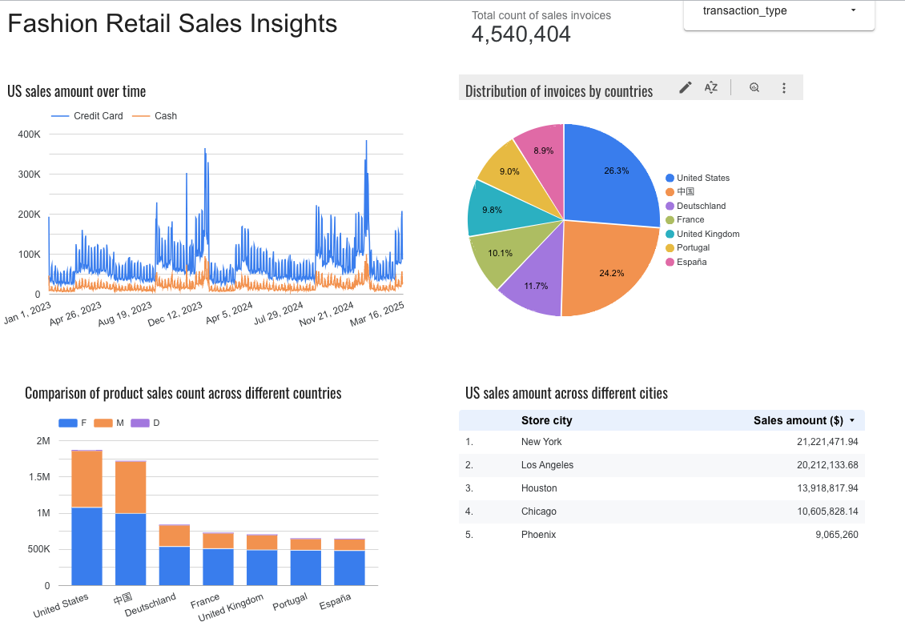

# Data Engineering Zoomcamp 2025 Project

This repository contains the final project that is required for the certification from Data Engineering Zoomcamp by Data Talks.

## Problem Description

Global fashion industry has been growing significantly around the world. It would be interesting to investigate the factors that affect the sales performance of a clothing/fashion brand.

Below are some sample questions that can be studied with the datasets:

- How does the sales performace varies between regions and countries? Ideally we can identify trends that lead to success in different markets.
- How do product categories (Feminie, Masculine and Kids) and product attributes (size, color) perform across different regions.
- How do different pricings and discounts affects sales and customer decisions.

## Datasets
The dataset is downloaded from Kaggle: **Global Fashion Retail Sales**. This synthetic dataset includes two years of transactional data for a multinational fashion retailer.
- https://www.kaggle.com/datasets/ricgomes/global-fashion-retail-stores-dataset?select=customers.csv

## Technologies
* **Workflow orchestration**: Kestra
    - I was expecting to use python in the ETL process, but thanks to the powerful Kestra, I don't have to write any python scripts for the pipeline!
* **Cloud**: GCP
* **Data Warehouse**: BigQuery
* **Containerization**: Docker
* **Infrastructure as code (IaC)**: Terraform
* **Batch processing**: dbt (executed by Kestra)

## Overview of the pipeline


## Guideline to reproduce the project
### Set up your Google Cloud project
You should set up your Google Cloud account and project before the `Terraform` step. I strongly recommend checking the [instructions](https://github.com/DataTalksClub/data-engineering-zoomcamp/blob/main/01-docker-terraform/1_terraform_gcp/README.md) from Data Engineering Zoomcamp if anything is unclear to you.

1. Create a GCP account if you don't have one. You should be able to have a free trial if it is your first time creating an account.

2. Create a new project and save the `project ID`.

3. Configure a service account for the project and download the key json file. Please confirm if the service account has all the necessary permission.
    - Viewer
    - BigQuery Admin
    - Storage Admin
    - Storage Object Admin

4. Download [Google Cloud SDK](https://cloud.google.com/sdk?hl=en) for local setup.

5. Set the environment variable to point the credentials to the json file.

```
export GOOGLE_APPLICATION_CREDENTIALS="<path/to/your/service-account-authkeys>.json"  

gcloud auth application-default login
```

### Create resources in GCP using Terraform
Data Engineering Zoomcamp provides a great [introduction](https://github.com/DataTalksClub/data-engineering-zoomcamp/blob/main/01-docker-terraform/1_terraform_gcp/1_terraform_overview.md) to Terraform. Please make sure you have installed Terraform on your local machine. You can follow the tutorial if you are not familiar with the setup.

After setting up Terraform, please navigate to the directory: `terraform`.
```
cd terraform
```

Please use the following command to create the resources in GCP:
```
terraform init
terraform plan
terraform apply
```
There should be one BigQuery Dataset and one Bucket created once the command finishes. Please confirm on your GCP dashboard.

<!-- ### Setting up Kaggle account and token
Create a [Kaggle account](https://www.kaggle.com/) and generate an API token. You should be able to download the token as `kaggle.json`.   -->

### Download raw data and uploading files to GCP with Kestra
We now use Kestra as our workflow orchestrator to download and upload raw data files. You should have `Docker` and `Docker Compose` installed on your local machine. Data Engineering Zoomcamp provides a detailed [instructions](https://github.com/DataTalksClub/data-engineering-zoomcamp/tree/main/01-docker-terraform/2_docker_sql) on how to set up `Docker` as well as some tutorials on how to use [Kestra](https://github.com/DataTalksClub/data-engineering-zoomcamp/tree/main/02-workflow-orchestration) as the workflow orchestrator.

Once `Docker` is set up, navigate to the directory: `kestra` and spin up the container with `docker compose`:

```
cd kestra
docker compose up -d
```

To access Kestra's dashboard, go to `localhost:8080` in your browser.

#### Key-value pair setup
The first step is to execute the key-value pair flow in Kestra. Please replace the necessary information in `gcp_kv_setup.yaml`. After then, navigate to `Flow` on the Kestra dashboard and click the "Create" button to create a flow. Copy the content from `gcp_kv_setup.yaml` to the editor in the UI and execute the flow.  

#### Download and upload the data files to GCP
We then download and upload the data files to GCP. Kaggle provides a `curL` command to download the zipped data files. We include this command in our Kestra workflow. 

Once the download is completed, we unzip the raw data in Kestra, upload the csv files to our GCP bucket, and create tables in BigQuery to prepare for the transformation. You should expect to see the following tables in your BigQuery dashboard:
```
-- check with below queries
-- These tables are clustered/partitioned during the process
-- Remember to input your project ID and dataset name

select * from {YOUR_PROJECT_ID}.{YOUR_BQ_DATASET_NAME}.customers limit 1;

select * from {YOUR_PROJECT_ID}.{YOUR_BQ_DATASET_NAME}.discounts limit 1;

select * from {YOUR_PROJECT_ID}.{YOUR_BQ_DATASET_NAME}.employees limit 1;

select * from {YOUR_PROJECT_ID}.{YOUR_BQ_DATASET_NAME}.products limit 1;

select * from {YOUR_PROJECT_ID}.{YOUR_BQ_DATASET_NAME}.stores limit 1;

select * from {YOUR_PROJECT_ID}.{YOUR_BQ_DATASET_NAME}.transactions limit 1;
```

The complete flow can be found in `gcp_upload.yaml`, and you can paste the config into Kestra UI and execute the flow. It may take some time (5-10 minutes) to finish as some of the csv files are large.

### Transform the data with dbt
We use `dbt cloud` to transform the data into a fact table in BigQuery. It turns out that `Kestra` is able to execute `dbt` command and transform the data given the `dbt models`. All the relevant dbt development is included in the `dbt` folder under this repo, and the Kestra workflow can be found in `gcp_dbt.yml`. You should be able to see the transformed table after you execute the flow in Kestra.

You should be able to execute the flow without a dbt cloud account. In case there are any unexpected error, you can execute the command in `dbt cloud`. Data Engineering Zoomcamp provides a great [instructions](https://github.com/DataTalksClub/data-engineering-zoomcamp/blob/main/04-analytics-engineering/dbt_cloud_setup.md) on how to set up `dbt cloud` with `BigQuery`. Please check this out if there are any issues.

## Dashboard visualization with Google Looker Studio

I used `Google Looker Studio` to create this [dashboard](https://lookerstudio.google.com/s/r9UYcRvqd7Q) that visualize the fashion data. Feel free to check the report by clicking the link.



### Analysis
By examining the time series chart, we can find that for United States, the sales amount peaks occurred in Q4/Q1. This is probably due to holiday sales in the end/start of the year.

The pie chart shows the distribution of invoices across different countries. We can see that the US and China have similar distribution, followed by the rest of the countries.

We can observe from the bar chart that female products have better sales for the other products. This pattern occurs for all of the countries.

The table summarizes the US sales amount for stores across different cities. New York and Los Angeles take the lead.

To replicate the dashboard, you need to click create a Data source by clicking the `Create` button, select BigQuery as your connector, and select the transformed table we produced from the previous steps. 